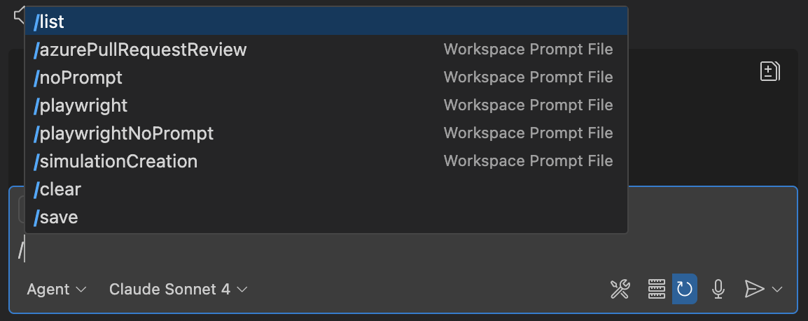

# Agents Use Repo

## Why?
As we step into AI using MCPs and Agents, additional setup can be used to leverage full potential.
This repo is dedicated to make prompting and AI use easier.

# Setup browser for Playwright MCP example
```bash
node setup-brave.js
```

# Use of prompts

Prompts are available to use in chat under /


# Use of instructions file

Enable at settings:
github.copilot.chat.codeGeneration.useInstructionFiles

